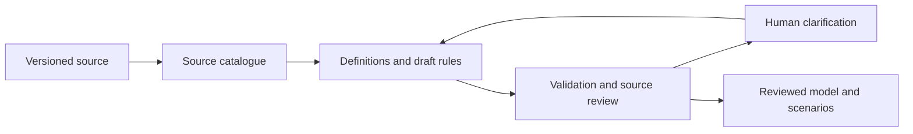

# Agent-assisted conversion of regulatory documents

Research date: 23 September 2026. Based on the current repository, the supplied EASA Revision 24 PDF, its publisher-provided XML, and the primary sources linked below. This is a proposed workflow, with a preliminary source inventory; it is not a completed conversion or a legal acceptance assessment.

**Recommendation:** build a persistent source catalogue and clarification workflow in front of the existing model. Agents extract and propose; deterministic checks and independent review challenge the proposals; humans resolve the decisions that require their expertise. Compile resolved material into the rules model. Keep unresolved and non-computational obligations visible.



**What the EASA source already provides**

The supplied PDF has 2,566 pages. The substantive FTL material starts on page 854 and ends partway through page 886. Appendix I starts on page 886; pages 887–888 retain the FTL running header while displaying a declaration form. Segmenting by running headers would include unrelated content. Page references here are one-based PDF viewer pages.

EASA publishes [Revision 24 in PDF, online and XML formats](https://www.easa.europa.eu/en/document-library/easy-access-rules/easy-access-rules-air-operations). I downloaded and inspected the [XML archive](https://www.easa.europa.eu/en/downloads/136682/en), rather than relying only on the format description:

- It is a ZIP containing a Microsoft XML package, including WordprocessingML and embedded EASA metadata.
- The metadata contains 3,658 topics with identifiers, content classifications, source information, dates and hierarchy. All 3,658 topic content-control references matched WordprocessingML content controls in the inspection.
- `ORO.FTL.205` has publisher ID `ERULES-1963177438-12065` and content-control ID `-1804923612`. Its three FDP tables are structured XML tables.
- Subclauses such as `(b)(1)` still need reconstruction from text and paragraph structure. A hyperlink displaying `ORO.FTL.110(c)` points to the parent heading, not precisely to paragraph `(c)`.
- The content identifies Revision 24, March 2026. Matching metadata and spot checks do not establish complete PDF/XML equivalence.

Use a deterministic adapter to join the EASA metadata to the content controls, preserve tables and links, and produce source units. Use agents for semantic decomposition and uncertain structure. Check representative tables against rendered PDF pages. For PDF-only documents, use text and layout extraction, heading/bookmark reconstruction, table extraction and OCR where necessary, with a separate extraction-quality review.

Pin the edition, publication and applicability dates, source URLs, retrieval date and hashes. Keep publisher IDs plus version-specific locations; test their stability across editions before relying on them for updates. The hashes inspected here were:

```text
PDF SHA256: 71e9264f25a8d5b24e74f64b52fc91db63c0472ad1d974fc8e61ab3a829870f1
XML ZIP SHA256: eea720b18130743e8e3f47f2d7395f9dce01f96f3c22d1ddd150671d77f349ae
```

Preserve the distinction between implementing rules, certification specifications, acceptable means of compliance and guidance material. They do not all have the same legal role. [EASA explains these categories](https://www.easa.europa.eu/en/faq/19117). The operator's applicable scheme and approvals are additional dependencies, not facts an agent can infer from a generic regulation. EASA also identifies Easy Access Rules as a consolidated reference rather than the authentic legal publication; retain links to the underlying instruments in the catalogue. [EASA XML documentation and publication status](https://www.easa.europa.eu/en/easy-access-rules-xml-export).

**The first deliverable: an inventory with coverage**

An initial heading scan found 17 ORO.FTL provisions, seven CS FTL.1 provisions, 50 AMC/GM headings, and 28 numbered definitions in ORO.FTL.105. These are structural counts, not counts of executable rules or proof of complete extraction.

| Source family | Initial catalogue contents |
|---|---|
| ORO.FTL.100 and CS FTL.1.100 | Scope and applicability, including exclusions |
| ORO.FTL.105 | 28 definitions, acclimatisation table, related guidance |
| ORO.FTL.110, .115, .120, .125 | Operator/crew responsibilities, FRM, flight-time specification schemes |
| ORO.FTL.200 and CS FTL.1.200 | Home base and changes of home base |
| ORO.FTL.205 and CS FTL.1.205 | Basic FDP, extensions, reporting, rest facilities, discretion and delayed reporting |
| ORO.FTL.210 and .215 | Cumulative flight/duty limits; treatment of positioning |
| ORO.FTL.220/.225/.230 and matching CS provisions | Split duty, standby and reserve |
| ORO.FTL.235 and CS FTL.1.235 | Rest, recovery, time-zone effects and reduced rest |
| ORO.FTL.240, .245, .250 | Nutrition, records and fatigue-management training |

Split each provision into atomic obligations, permissions, definitions, exceptions and supporting explanations. One paragraph may create several records, and several paragraphs may support one calculation. Preserve this many-to-many relationship. Keep shared terminology scoped: a definition applying to one subpart must not automatically become a universal definition.

Every source unit receives a recorded disposition: extracted, supporting context, procedural/human assessment, excluded with a reason, or unresolved. Link its tables, cells, notes and exceptions. Follow references outside the initial FTL range, including other parts of the regulation and operator documents. Missing dependencies remain explicit.

The key completeness question is: **which source units have no disposition?** Reviewing only generated rules cannot reveal rules the extractor omitted. Audit the source-unit inventory itself against headings, numbering and selected rendered pages; a 100% disposition rate over an incomplete inventory is misleading.

**A small agent team**

These are separate responsibilities and prompts; they need not be separate services or permanently running agents.

| Role | Assigned work | Required output |
|---|---|---|
| Coordinator | Select scope, schedule work, maintain shared vocabulary and merge proposals | Versioned task ledger; consistent IDs; coverage status |
| Extraction workers | Read coherent provision groups with their definitions, tables and related guidance | Source-linked definitions, obligations, exceptions, references and uncertainties |
| Model mapper | Translate reviewed concepts into the current model | Draft model objects; explicit unsupported constructs and required inputs |
| Independent reviewer | Compare original source with catalogue/model in both directions | Missing material, unsupported assumptions, semantic mismatches and distinguishing scenarios |
| Clarification guide | Consolidate issues, gather evidence, route questions and record answers | Prioritised human questions; versioned decisions; impacted rules/tests |

Start with a coordinator and two extraction workers, then reuse workers for review and clarification. Parallelise independent rule families, not arbitrary groups of pages. Each work packet should include its source units, ancestor scope, referenced definitions, relevant AMC/GM/CS, current approved decisions and required output schema. Resolve shared definitions before compiling their dependants.

Workers propose changes to a shared registry. A single merge step resolves duplicate concepts and conflicting edits. Require a source reference for every extracted assertion. Permit unresolved results; never make the output schema require a guessed number or interpretation. Use explicit task IDs and bounded retries. No agent should silently promote its own interpretation to an approved decision.

**Minimal records to add around the current model**

| Record | Essential contents |
|---|---|
| Source unit | Document/version/hash, publisher ID, clause path, exact text, PDF/XML location, source category, dates, references |
| Concept/definition | Stable scoped ID, source wording, proposed operational meaning, type/unit, dependencies, status |
| Draft requirement | Actor, applicability, obligation/permission, conditions, calculation/constraint, exceptions, source links, unresolved points |
| Question | Issue type, evidence, alternatives, example of different outcomes, affected IDs, owner and blocking scope |
| Decision | Answer, rationale, supporting evidence, reviewer, date, applicable operation/version, superseded decision |
| Scenario | Inputs, expected outcome, source/decision basis, independent reviewer and test status |

Use one small persistent store with versioned exports. Python and Pydantic already fit this repository. SQLite plus JSON exports would be sufficient for a local pilot; use a shared service/database when several humans must edit concurrently. The catalogue, questions and decisions are authoritative state; agent chat is supporting context.

LangGraph is an optional orchestration layer if pause/resume and branching become cumbersome. Its [persistence](https://docs.langchain.com/oss/python/langgraph/persistence) and [interrupt](https://docs.langchain.com/oss/python/langgraph/interrupts) features support this pattern. Interrupted nodes run again when resumed, so record writes and compilation jobs must be safe to retry without duplication. A simple persisted Python job queue can implement the same architecture initially.

**Human clarification as a guided review**

Run validation during extraction and again across the assembled ruleset. Do not wait until the whole document has been translated. Before asking a human, the guide should check the relevant definitions, cross-references and approved decisions, repair extraction errors, and merge duplicate questions.

Route the remaining issues by their cause:

| Cause | Appropriate next action |
|---|---|
| Missing or garbled extraction | Re-extract or inspect the page |
| Answer already present elsewhere | Link the evidence and revise the proposal |
| Unclear legal/domain meaning | Ask the designated FTL expert; preserve competing readings |
| Operator-specific choice or approval | Request the applicable manual, scheme or approval evidence |
| Missing operational data | Ask the data owner for the field and its meaning |
| Model/runtime limitation | Assign engineering work; do not ask a domain expert to disguise it as a policy choice |

Present a few related decisions at a time, ordered by how many other rules they block and their consequences. Show the exact passage, a plain-language question, the plausible interpretations, and a small scenario where they produce different outcomes. Allow a new interpretation, deferral, request for evidence or escalation. A suggested answer needs evidence and must remain visibly proposed.

A concrete question from this PDF:

> **Post-flight duty input — ORO.FTL.210(c), page 869**
>
> The provision requires post-flight duty to count as duty and requires the operator to specify a minimum in its operations manual. Which applicable manual provision supplies that minimum, and does it vary by operation, aircraft or airport?
>
> **Needed from:** operator/FTL specialist, with manual version and location.
>
> **Affected:** duty duration definitions and cumulative duty calculations.
>
> **Until resolved:** extract the obligation and dependency; leave the operator parameter unset.

A separate question concerns how operational timestamps and the manual minimum are combined. For illustration only, 15 versus 30 minutes after a 17:00 endpoint changes the calculated duty end to 17:15 versus 17:30. Neither value is an EASA default. Showing that consequence is more useful than asking a person to approve JSON.

Another important distinction: EASA's defined *unknown state of acclimatisation* is a domain state with specified tables. It must not be conflated with *the system has no acclimatisation data*. The latter needs information or an indeterminate result. ORO.FTL.105 and ORO.FTL.205(b), PDF pages 854 and 866.

When a human answers, save a decision scoped to its source revision and operation. The agent shows the proposed model change and example consequences, applies the agreed change, and rechecks affected dependants. For multiple reviewers, define owners and how conflicting decisions are escalated. A human answer records a position; it does not amend the source regulation.

This approach is consistent with [Catala's account of collaboration in coding law](https://book.catala-lang.org/en/4-1-general.html): retain the source, implementation and reasons for interpretive choices together. Borrow that practice without needing to replace this repository's model.

**Validation needs several layers**

1. **Extraction fidelity:** hierarchy, numbering, table shape and values, footnotes, links and source-version alignment. Compare independent table extraction with rendered source where needed.
2. **Coverage and provenance:** every source unit accounted for; every generated assertion supported by source material or a named interpretation decision. Check both source-to-model and model-to-source.
3. **Structural validity:** schemas, field references, types, units, missing definitions, dependency cycles and unresolved references.
4. **Semantic consistency:** applicability, exception precedence, overlapping table rows, uncovered cases, temporal boundaries, calendar versus elapsed-time windows and unknown-data handling.
5. **Behaviour:** independently reviewed examples and boundary cases, followed by regression tests. Agents can propose scenarios, but expected answers should be derived from source and reviewed decisions rather than merely copied from the generated code.

For the FDP table on page 866, test both sides of a reporting-time boundary, operating-sector counts, the range crossing midnight, and each acclimatisation branch. Separate table lookup tests from tests of how reporting time and sector count are derived. For cumulative limits, establish window anchoring, timezone, cross-boundary allocation and calendar semantics explicitly before declaring results correct.

Use deterministic checks where possible, model reviewers for semantic findings, and experts to calibrate the review. [Anthropic's evaluation guidance](https://www.anthropic.com/engineering/demystifying-evals-for-ai-agents) supports combining these forms of evaluation. Agent agreement and numerical confidence are insufficient acceptance criteria.

**Fit with the repository**

The current [Rule model](/Users/viktorforsman/Code/rules/models/rule.py:55) already provides applicability, measured value, minimum requirement, maximum limit and adjustments. It is a useful compilation target:

| Catalogue concept | Mapping |
|---|---|
| Quantitative maximum/minimum | `Rule.limit` / `Rule.requirement` |
| Applicability | `Rule.applicability` |
| Measured or derived amount | `Rule.value`, shared definition, potentially `Projection` |
| Numerical source table | Proposed versioned table registry referenced by `TableLookupValue` |
| Exception | Separate rule or explicitly ordered adjustment |
| Definition, procedure, discretionary judgment | Catalogue record with dependencies; not necessarily a numerical `Rule` |

The first inventory can proceed immediately. Executable validation requires further work: [Rule.evaluate](/Users/viktorforsman/Code/rules/models/rule.py:86), [table lookup and projected values](/Users/viktorforsman/Code/rules/models/decision_table/value.py:232) are unfinished; [field-path scope checking](/Users/viktorforsman/Code/rules/models/decision_table/condition.py:11) is a TODO. [Decision tables](/Users/viktorforsman/Code/rules/models/decision_table/decision_table.py:51) select the first matching row, which must be accounted for when mapping overlapping conditions.

A concrete runtime issue also surfaced: nominally strict duration comparisons currently include equality in [comparison.py](/Users/viktorforsman/Code/rules/models/comparison.py:149). The existing [FDP test](/Users/viktorforsman/Code/rules/tests/rules/fdp/test_rules_fdp.py:163) checks serialization and generates Mermaid, but compares the Mermaid output with the file it just wrote. It does not independently validate rendering or regulatory meaning. These findings should become engineering issues before executable acceptance; no source code was changed during this research.

Add an explicit unresolved/indeterminate outcome outside or within the runtime result contract. Missing data must never silently become a zero, default limit, pass or not-applicable result. Keep workflow status separate from compliance results.

**A bounded first implementation**

First catalogue all substantive ORO.FTL and CS FTL.1 material and linked AMC/GM, including procedural obligations. Establish operation scope and track outside references. The reviewed inventory should contain definitions, candidate rules, tables, dependencies and a grouped clarification queue before comprehensive compilation starts.

Then exercise the complete loop on basic FDP: ORO.FTL.105 definitions, ORO.FTL.205(b), positioning under ORO.FTL.215, and the associated guidance. Represent dependencies from extensions, rest and standby explicitly; prevent the basic-FDP result from being mistaken for a complete FTL compliance result. Add those interacting families once the workflow is demonstrated.

Pilot acceptance should require all selected source units to have reviewed dispositions; all model nodes to have provenance; no unresolved material assumptions in the released subset; reviewed boundary scenarios; and a demonstrated decision or source revision that reopens affected rules. Measure extraction omissions, unsupported assertions, substantive questions, human review time and cost per reviewed provision. Estimate larger-document effort from that pilot, rather than from page count or generated JSON volume.

Only this research note was added. The PDF was read, selected pages were rendered, the publisher XML was inspected, and the current model was examined. The inventory and workflow have not yet been implemented or comprehensively validated.
